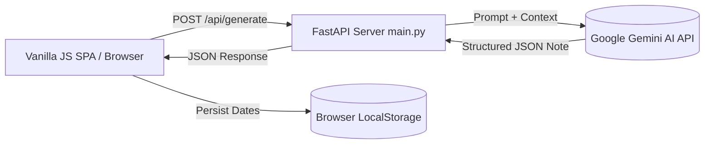

# My Special Year Calendar — Engineering Design Doc

**Author:** Senior Staff Engineer
**Status:** Draft v0.1
**Last updated:** 2026-08-07
**Reviewers:** Engineering Team

---

## 1. Summary

"My Special Year Calendar" is built as a lightweight Python (FastAPI) backend paired with a vanilla HTML/CSS/JS single-page frontend. The system relies on Google Gemini AI (`google-genai` SDK) to generate structured 2-sentence warm poem notes for user-specified dates, returning JSON outputs rendered directly on an interactive 12-month CSS grid calendar. All persistent state is saved locally on-device via `localStorage`.

## 2. Assumptions

- **Target scale:** <5,000 active sessions in v1.
- **Latency budget:** p95 <3s for AI poem note generation.
- **Platform:** Modern desktop and mobile web browsers (Chrome, Safari, Firefox, Edge).
- **Cost ceiling:** <$0.01 per calendar generation session using `gemini-2.5-flash`.
- **Out of scope:** Server-side database, user authentication, Google Calendar API OAuth sync.

## 3. Goals & non-goals

**Goals (v1):**
- Fast API endpoint for generating warm, 2-sentence poem notes for personal dates via Gemini API.
- Responsive, zero-dependency single-page frontend rendering a 12-month scrollable calendar grid.
- Full local client-side persistence of personal dates and generated notes using browser `localStorage`.
- High reliability with structured JSON output parsing and graceful fallback notes on network failure.

**Non-goals (v1):**
- No user login or account management infrastructure.
- No remote database (PostgreSQL, SQLite, Redis) — device-local state only.
- No real-time multi-device sync or social sharing backend.
- No background workers or cron job notification triggers.

## 4. Architecture



**What's here:**
- **FastAPI Backend (`main.py`):** Serves static frontend files and exposes `/api/generate` and `/api/health`.
- **Gemini Client Integrator (`prompts.py`):** Configures system prompts and handles structured JSON response parsing.
- **Vanilla JS Frontend (`app.js`, `calendar.js`):** Manages calendar state, date entry DOM events, and modal interactions.
- **CSS Styling (`style.css`):** Provides glassmorphism aesthetic, theme CSS variables, and 12-month responsive grid layout.

**What's deliberately NOT here:**
- No ORM or SQL database server — eliminates storage infra overhead.
- No Node.js runtime or NPM build step — plain HTML/CSS/JS served directly by FastAPI.
- No WebSockets or async task queues (Celery/Redis) — HTTP requests are synchronous with <3s budget.

## 5. Key components

### 1. FastAPI Application Server (`backend/main.py`)
- **Responsibility:** Mounts static web assets and handles REST API requests.
- **Tech choice:** Python 3.11+, FastAPI, Uvicorn.
- **Why this choice:** Extremely fast startup, native async handling, single-command deployment with `uv`.
- **Interface:** Exposes `POST /api/generate` and `GET /api/health`.

### 2. AI Prompt Service (`backend/prompts.py`)
- **Responsibility:** Constructs Gemini prompt instructions and enforces structured JSON output schema.
- **Tech choice:** `google-genai` Python SDK (`gemini-2.5-flash`).
- **Why this choice:** Native structured output support (`response_mime_type="application/json"`), low latency (<1.5s), and low cost.
- **Interface:** `generate_poem_note(date_str: str, title: str, context: str) -> dict`.

### 3. Frontend App & Calendar Engine (`frontend/app.js` & `frontend/calendar.js`)
- **Responsibility:** Generates 12-month calendar DOM nodes, handles user inputs, makes fetch API calls, and syncs `localStorage`.
- **Tech choice:** Vanilla JavaScript (ES6 Modules).
- **Why this choice:** Zero build tool overhead, instant page loads, highly maintainable.
- **Interface:** `CalendarEngine.render(year)`, `StorageEngine.saveDate(entry)`, `ModalEngine.open(entry)`.

## 6. Data model

```typescript
// Client-side & API JSON Data Model

interface PersonalDateEntry {
  id: string;            // UUID v4
  date: string;          // YYYY-MM-DD
  title: string;         // e.g. "Mom's 60th Birthday"
  context?: string;      // e.g. "Loves gardening and autumn"
  poemNote?: string;     // AI generated 2-sentence note
  season: 'spring' | 'summer' | 'autumn' | 'winter';
  createdAt: number;     // Epoch timestamp (ms)
}

interface GeneratePoemRequest {
  date: string;
  title: string;
  context?: string;
}

interface GeneratePoemResponse {
  poemNote: string;
  season: string;
  status: 'success' | 'fallback';
}
```

## 7. API surface

### `POST /api/generate`
- **Input:**
  ```json
  {
    "date": "2026-10-14",
    "title": "Mom's 60th Birthday",
    "context": "Loves gardening and autumn leaves"
  }
  ```
- **Output (200 OK):**
  ```json
  {
    "poemNote": "As October's leaves turn to gold, sixty years of warmth unfold in her garden of love.",
    "season": "autumn",
    "status": "success"
  }
  ```
- **Errors:**
  - `400 Bad Request`: Missing `date` or `title`.
  - `500 Internal Server Error` / `503 Service Unavailable`: Gemini API timeout or key failure; client falls back to local template poem note.
- **Latency budget:** p95 < 2.5s.

### `GET /api/health`
- **Output:** `{"status": "ok", "model": "gemini-2.5-flash"}`

## 8. Key trade-offs (with rejected alternatives)

### Decision 1: On-Device `localStorage` vs. Server Database (SQLite/PostgreSQL)
- **Chose:** On-device `localStorage`.
- **Considered:** Server SQLite or PostgreSQL database with session cookies.
- **Why we picked this:** The brief strictly mandates no user accounts or auth. Local storage guarantees zero user data exposure, zero server DB maintenance, and instant zero-latency loads.

### Decision 2: Vanilla JavaScript vs. React/Vite SPA
- **Chose:** Vanilla JavaScript (ES6 Modules) served statically.
- **Considered:** React + Vite build chain.
- **Why we picked this:** Aligns with project guidelines for simple web apps, avoids heavy node_modules dependencies, and allows FastAPI to serve all static assets directly.

### Decision 3: Direct Synchronous Gemini API Call vs. Background Job Queue
- **Chose:** Synchronous FastAPI endpoint call with `gemini-2.5-flash`.
- **Considered:** Async Celery/Redis queue with WebSockets.
- **Why we picked this:** `gemini-2.5-flash` completes generation in 1.0–1.8 seconds. A queue adds unnecessary infra complexity for a synchronous UI interaction budget of <3 seconds.

## 9. Risks & unknowns

- **Gemini Rate Limits / API Key Quotas:** — *Likelihood: Low* — *Mitigation:* Catch API errors gracefully and return a fallback warm poetic note stored in client code.
- **Invalid Date Input formats:** — *Likelihood: Med* — *Mitigation:* Enforce standard HTML5 `<input type="date">` ISO date formatting (`YYYY-MM-DD`).
- **Browser `localStorage` Cleared:** — *Likelihood: Low* — *Mitigation:* Acknowledge in UI that data is stored locally; provide simple JSON export/import button if needed.

## 10. Testing strategy

**Unit tests (`tests/test_backend.py` using `pytest`):**
1. **`test_determine_season`**: Verifies `determine_season(date_str)` correctly maps date strings (`YYYY-MM-DD`) to their corresponding season (`spring`, `summer`, `autumn`, `winter`).
2. **`test_prompt_construction`**: Asserts that `build_poem_prompt(date, title, context)` formats the system/user prompt containing date, title, context, and season guidance.
3. **`test_parse_poem_response_success`**: Verifies that structured JSON strings returned by Gemini parse cleanly into the expected dictionary schema (`poemNote`, `season`).
4. **`test_fallback_poem_note_on_api_error`**: Tests that when the Gemini API is unconfigured or throws an exception, `generate_poem_note(...)` returns a valid, non-empty fallback poem note without raising an unhandled exception.
5. **`test_health_endpoint`**: Verifies `GET /api/health` returns status `200` with `{"status": "ok", ...}` payload using FastAPI `TestClient`.
6. **`test_generate_endpoint_validation`**: Tests that `POST /api/generate` returns status `422` (Unprocessable Entity) when required fields (`date` or `title`) are omitted from the request body.

**Integration tests (one per major user flow):**
1. **`test_full_poem_generation_flow`**: Sends a valid `POST /api/generate` request via FastAPI `TestClient` (with mocked Gemini API output), asserting HTTP 200 response code and valid JSON containing `poemNote` and `season`.

**Deliberately NOT tested (and why):**
- **Actual Gemini LLM poetry output quality:** LLM creativity is non-deterministic; unit tests mock LLM API calls.
- **CSS animations & visual transitions:** Visual aesthetics are verified manually during UI review.
- **Browser `localStorage` engine behavior:** Covered by standard browser Web Storage API compliance.

## 11. Rollout & monitoring

- **Rollout:** Local execution via `uv run uvicorn main:app`.
- **Monitoring:** Log requests with timing metadata to console; monitor 5xx error rate and Gemini API call latency.
- **Rollback plan:** Revert to fallback static poem templates if Gemini API service degrades.

## 12. Cost & capacity

- **Per-request cost:** `gemini-2.5-flash` ~ $0.0001 per poem note generation.
- **Monthly budget at 1,000 users (5 dates each):** ~$0.50 / month.
- **Bottleneck at scale:** Gemini API rate limit per minute; mitigated by user-level debounce on submit button.

## 13. Open questions

- [ ] Should fallback poem notes be randomized from a client-side pool of 12 seasonal templates? — *Owner: Frontend Dev*
- [ ] Is CORS configuration required if frontend is served from the same FastAPI origin? — *Owner: Backend Dev*

## 14. Out of scope

- **No authentication / user tables** — strictly local storage.
- **No push notifications or email alerts.**
- **No multi-language translation pipeline.**
